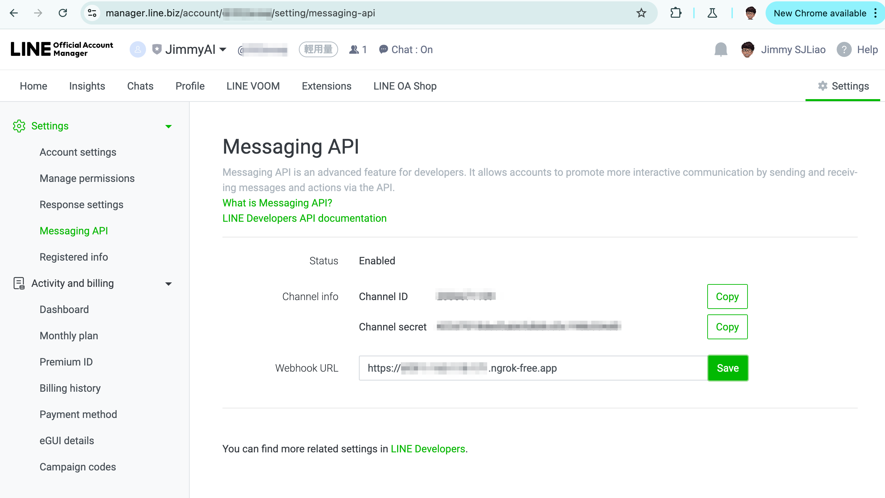
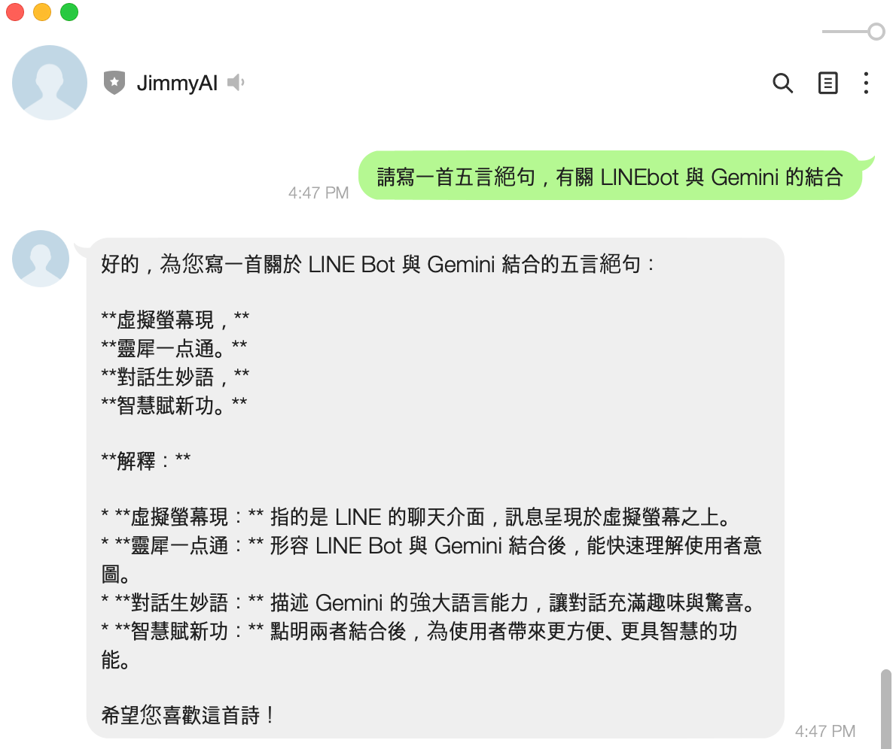

# LINEbot with Gemini 2.0-flash-exp

A test application for LINEbot with **Gemini 2.0-flash-exp**.

## Pre-requisites
1. Python, virtualenv, pip, and ngrok are required to run this application.
2. Prepare the LINE Messaging API channel and get the channel access token and channel secret.
    ```bash
    export LINE_CHANNEL_ACCESS_TOKEN=<YOUR_CHANNEL_ACCESS_TOKEN>
    export LINE_CHANNEL_SECRET=<YOUR_CHANNEL
    ```

3. Prepare the Gemini API key and secret.
    ```bash
    export GEMINI_API_KEY=<YOUR_GEMINI_API_KEY>
    ```

## Installation
1. Clone this repository.
2. Create a virtual environment.
    ```bash
    pyenv virtualenv 3.10.13 linebot-gemini
    pyenv shell linebot-gemini
    ```

3. Install the required packages.
    ```bash
    pip install -r requirements.txt
    ```

## Quick test for Gemini API
1. Run the test script.
    ```bash
    python test_gemini.py
    ```

2. The test script will print like this:
    ```bash
    $ python test_gemini.py
    Ah, the big question! The meaning of life is one of the most pondered and debated topics in human history. There's no single, universally accepted answer, and that's part of what makes it so fascinating. It's a deeply personal and often evolving question.

    Here's a breakdown of why it's so complex and some common perspectives:

    **Why there isn't one answer:**
    ...
    ```

## Run the LINEbot webhook server
1. Open Terminal, export the environment variables, and run the webhook server.
    ```bash
    export LINE_CHANNEL_ACCESS_TOKEN=<YOUR_CHANNEL_ACCESS_TOKEN>
    export LINE_CHANNEL_SECRET=<YOUR_CHANNEL
    export GEMINI_API_KEY=<YOUR_GEMINI_API_KEY>
    ```

2. Run the webhook server.
    ```bash
    python app.py
    ```

3. Copy the ngrok URL and set the webhook URL in the LINE Messaging API channel settings.



4. Open LINE app and send a message to the LINEbot.


